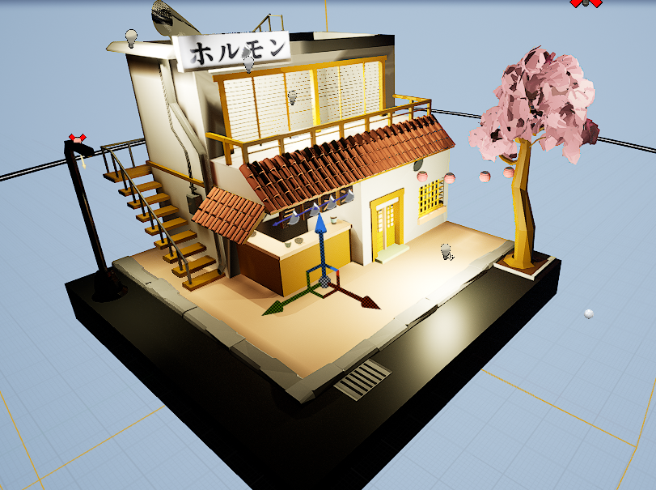
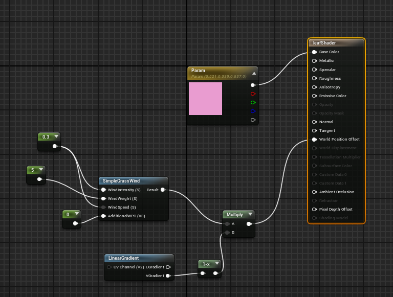
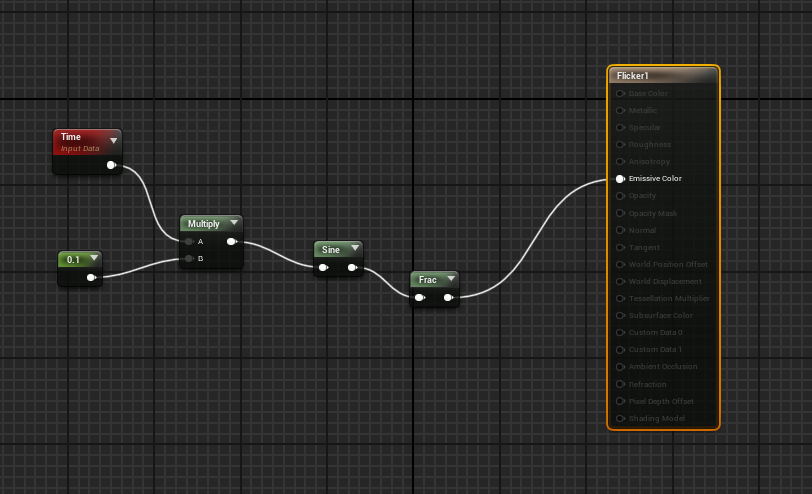
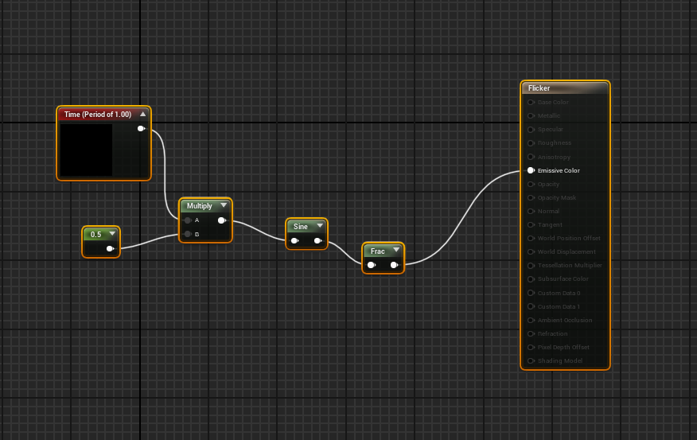
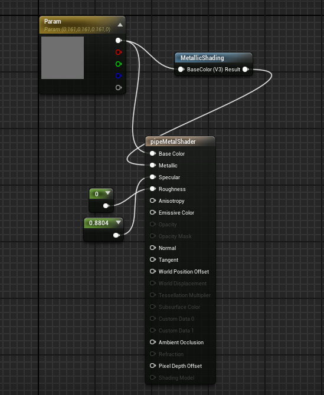
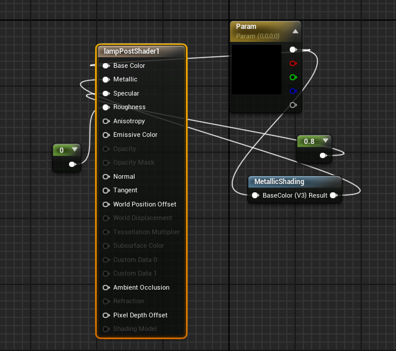
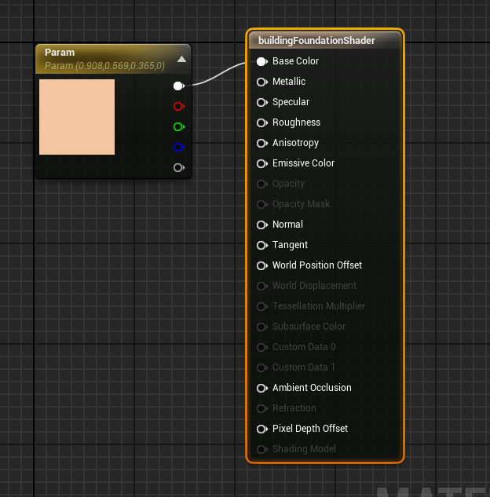
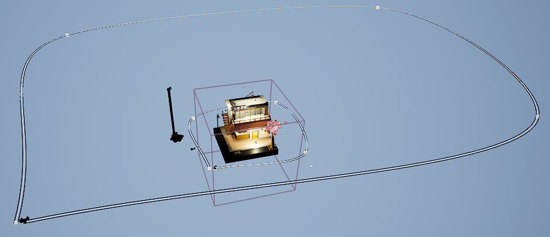

# **Animation**

# **Animation Process** -

## **Leaves Blowing in Wind** -

- Animation was created to give illusion of leaves blowing in the wind. The animation was applied to the leaf shader and manipulated using the simple grass wind mechanic. This is then applied to the position offset consistently.

## **Advert Lighting Flickering** - 

- Animation was made to give lighting behind advert board a dilapadated flickering effect. A sine offset multiplcation of a time constant and 0.1 is put into a fraction and used as the emissive colour of the light, with the time being the interval the light changes from white to dark. 

## **Lamp Post Lighting Flickering** - 

# **Materials Process** -

- All materials applied to the objects had to be done from scratch. This is because a wellknown pipeline issue of exporting from Maya to UE4 is that Arnold materials are not supported by UE. I therefore had to make all materials inside the engine. 

- I made 2 kinds of materials. Specular materials like metal used in the pipes and lamp post, and more ambient lighting materials used in other objects such as the street floor.

## **Metallic Material Examples**
### **Chrome Metal Material**

### **Black Washed Metal Material**

## **Ambient Material Examples**

### **Building Foundation Material**

# **Camera Setup**

- To set up the cameras, 2 camera rigs and a camera crane were used, to give moving shots and pitching shots of the diorama. These cameras were then used in the sequencer, and moved by using keyframe manipulation. In each camera track, for the rigs, the position of the camera actor was set to 0.0 at the beginning frame and 1.0 at the last frame of the track, signalling the end of the rig.

- Similarly the camera crane was just as simple to set up, with the exception of setting keyframes for the crane's pitch rather than position on a rig. I set the beginning pitch to be 50 degrees, and the ending pitch to be -40 degrees, giving a nice panning shot of the diorama.

# **Pipeline Issues**

- All object files were exported into UE4 successfully with the exception of the seating and the fan vents. I attempted to triangulate these models but this still proved to be unsuccessful.

- I did however manage to reproduce the look of the materials used in Maya using UE materials, using the asset editor to manipulate the properties of them, such as refractivity of light, specularity and other properties.

