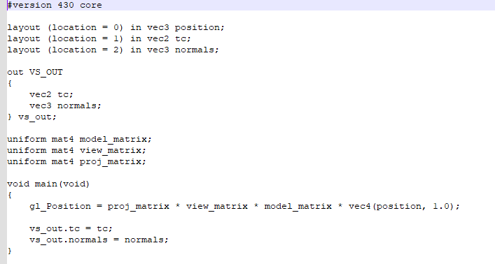

# **Interaction**

# **Model Loading/Positioning Process**

- In total 40 objects are loaded into the application from Maya, all being declared as meshes.

- These 40 meshes are loaded in as .OBJ files, also known as Object files, that are located within the Pipeline Interaction folder of the project.

- These meshes are all assigned their corresponding .OBJ files in the loadModels helper function which is called inside the startup method.

- Inside the .OBJ file some positional data is stored. But in order to manipulate these positions, they must be stored seperately in their own variable. I wish to manipulate all outside objects in the diorama, so I store all positional data of those objects as 3 point vectors.

- When wishing to change the active positional matrix and hence link the position variable to an object, the matrix must be translated in line with that model's current position. Scaling is performed using global scaling variables set in the file's header.

# **Shaders**

- Fragment shaders handle lighting, colours, shadows and many other important aspects. In the fragment shader I utilise, several constants and uniforms are declared.

- Ambient, Diffuse, Specular and Shininess uniforms are declared, along with their corresponding colours. These can be accessed from the source code and assigned values.

- Textures are also declared and assigned bindings from 0 to 3. These textures are utilised also when calculating the fragment's colour.

- Vertex shaders handle the programmable shading of individual vertices.

- Uniforms are declared handling the several matrices used in the code.

- These matrices are utlised to calculate a global positioning value.

# **Materials**

- Textures in the application are generated using the incredibly useful gl texture methods. 

- Textures are first initialised in the setup code by generating then binding them to a GLuint object. 

- Parameters can then be set on how the texture wraps around the model.

- The image is then loaded in and the width, height, and channels are all calculated and generate a 2D texture than can then be mipmapped.

- Textures inside the code have to be set as the active texture before drawing an object in order to see the results. This is done by using the glActiveTexture and glBindTexture methods where the first binded texture is reassigned a new texture. The location of the new texture is fetched and stored inside a GLint variable which is then passed into the glUniform method.

# **Lighting**

- Ambient, Diffuse and Specular lighting is first declared here, with the emphasis being on the lighting not being specular to begin with when drawing.

- The lighting's intensity, specularity and shininess can all be changed for example though to give a metallic view of an object, by decreasing ambient lighting and increasing shininess. It can then be set back to normal when the user wishes.

# **Interactivity**

- The exploration camera can be controlled by pressing the W, A, S, D keys to go forwards, left, backwards and right respectively. It can also be moved up and down on the y-axis using the space and tab keys.

- The model's rotation can be controlled using the UP, DOWN, LEFT and RIGHT arrow keys, which can be used simultaneously with the camera.

- The user can explode the position of the model by pressing the E key to explode all the outdoor objects of the diorama. 

- The user can retract the position of the model by pressing the R key to retract all outdoor objects of the diorama.

# **Pipeline Issues**

- Unfortunately I was not able to map the advert images on to their respective objects.