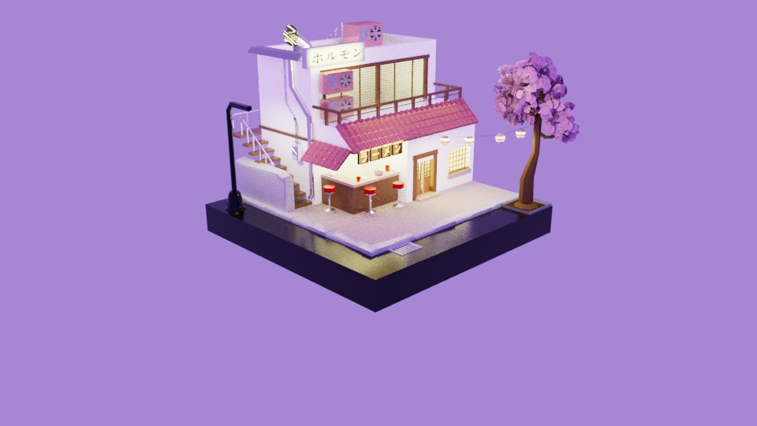
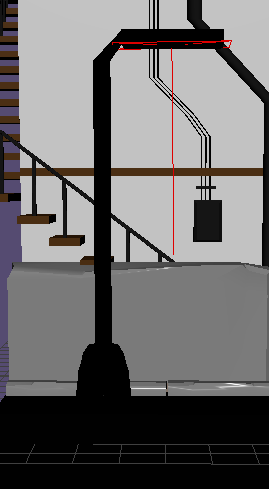
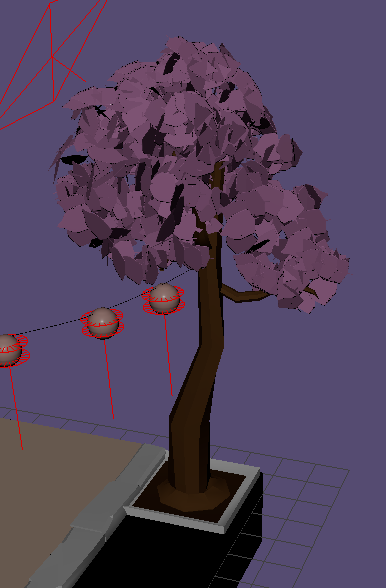
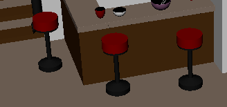
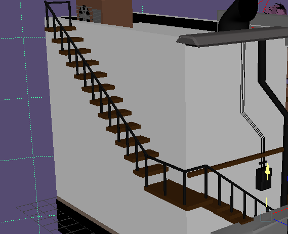
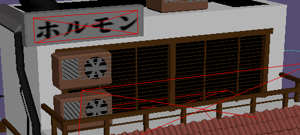
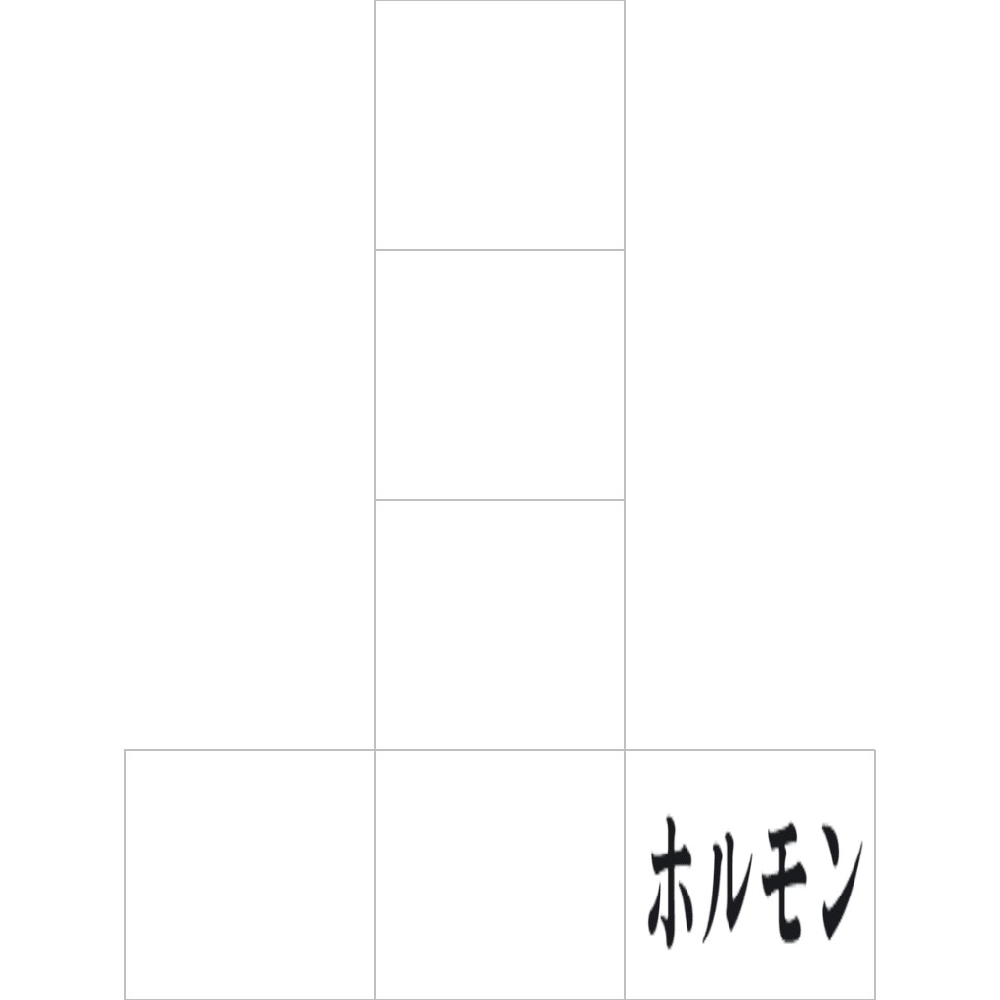
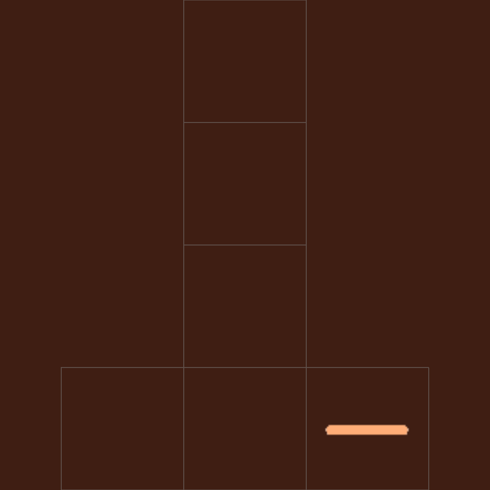

# **Render**

Having a large interest in Japan and Japanese architecture, the inspiration I chose was an image made by Roman Klco, who in comparison modelled his version on Blender with a slightly different style. I wanted to capture the same building and most of the objects used in the environment using the modelling skills I learned in the course.

In comparison, here is my version in Maya using Arnold Materials. I wanted the scene to have much warmer lighting and for the objects to be less realistic and more of a low-poly style. This is evident for example, in the leaves I created in the trees, with each individual leaf being more of a blocky style.

# **Modelling Process**

Overall the scene took over 2 weeks to model, with there being a lot of individual objects to model, the scene proved to be much more complex than initially anticipated. In this section I will cover each individual object, their respective grouping and how I modelled them, textured them and applied lighting to the scene.

## **1. Street Floor** -

- One of the least complex shapes in the scene, the shape was modelled starting with a polygon cube and scaled out to be a size of 10 x 10 x 3 units.
- The street floor would act as the anchor for the whole scene and the lowest down object on the y-axis.

## **2. Kerbs and External Wall** -

- Each kerb was modelled first using a polygon cube, scaled to be a slim cuboid that would rest on top of the street floor yet higher than the building foundation object.
- I then applied edge loops around the cuboid using the multi cut tool horizontally, with the edges being inserted close to the edges of the cuboid.
- Bevels were then added between the newly inserted edge loops and the existing edges. These bevels were moved and distorted to create a chipped effect in the kerb's concrete.
- External Wall was modelled identically to the kerbs but scaled and bevels moved and modified.

## **3. Gravel Yard / Building Foundation** -

- Due to the similar height and width, the building foundation was started by duplicating the street floor and scaling it down along the x and z axes.
- I then applied an aiStandardSurface material using a sandy gravel colour.

## **4. Sewer Drain** - 

- Started with a polygon cube, and flattened on the z-axis.
- Parallel edge loops were made on the top face of the cuboid and holes were made between every 2nd occurring edge loop.
- Holes were deepened to add depth.

## **5. Lamp Post** -

- Used 3 polygon shapes, 2 cubes and a cylinder.
- Cylinder was modelled into a bell shape by elongating the y-axis and flattening the bottom by adding a bevel.
- 1st cube acted as the pole which was lengthened on the y-axis.
- 2nd cube acted as lamp post light which was elongated and then combined to the 1st pole in a curve.
- Lamp post objects were then combined together in a mesh union.

## **6. Tree** -

- Tree consists of several parts, the tree holder, the soil, the tree trunk, tree branches and leaves.

### **6.1. Tree Holder** -

- Polygon cube was flattened and then extruded on the top face inwards.
- Extruded face was then sunk inwards to give appearance of a concrete basin.

### **6.2. Soil** -

- A flattened polygon cube was inserted into the tree holder and combined together in a mesh union with the tree holder.

### **6.3. Tree Base** -

- A polygon cylinder was first used and modified by changing the subdivisions axis to 8, giving a low-poly effect.
- The base was then elongated on the y-axis and subsequently edge loops were inserted and moved to give a more natural, crooked shape.

### **6.4. Tree Branches** -

- The tree base was duplicated and shrunk down to give the impression of a branch. The branches were then modified by having different bends and twists in their geometry, and then placed at different areas on the tree.

### **6.5. Leaves** -

- An individual leaf object was modelled by first using a reference image of a leaf but sculpted to be a low-poly resemblance.
- After modelling one leaf they were duplicated enmasse into groups of 20 leaves, and translated mathematically by changing their rotation and position according to the amount of leaves being duplicated.
- After duplicating a single leaf into a small cluster, these clusters were then duplicated themselves and handplaced onto the tree for a more natural look. 

### **7. Seating** -

- 3 polygon cylinders were used acting as the base, stand and seat. The base and seat were widened and scaled, with the base being similar to the lamp post acting as a bell shape. The stand was then extended on the y-axis but shrunk on the x and z axes.
- These shapes were then combined into a mesh union.

## **8. Bar** - 

- 4 cube polygons were used initially, being scaled on the x and z axes to be longer and wider. These shapes were then positioned and combined in a mesh union to be 2 shapes, representing the base of the bar, and the countertop.

### **8.1. Bar Bowls and Cups** -

- Sphere polygons were used by cutting them in half and then sculpted in various ways to represent either a bowl or a cup.

## **9. Roof Tiles** -

- Each roof tile was modelled by combining 2 polygon shapes, a pipe and cube. They were made to be the same length, with the pipe being made taller on the y-axis. 
- The shapes' edges were bevelled out to give a ceramic tile look and then combined into a mesh union.
- The tiles were placed mathematically by special duplicating them by offsetting their x-axis positioning to give the effect of being placed into rows.

## **10. Stairs** -

- Steps were made using polygon cubes that were flattened. These steps were then special duplicated mathematically by calculating the offset on all axes, ensuring they were evenly spaced. 
- The railings were made using polygon cylinders that were also special duplicated using the same calculations used for the steps.

## **11. Drain Pipe and Steam Vent Pipe** -

- Both made using polygon cylinders. 

### **11.1. Drain Pipe** -

- The drain pipe was lengthened considerably stretching from the rooftop to the street floor. Edge loops were added and then moved to make the pipe bend at intersections.

### **11.2. Steam Vent Pipe** -

- 2 polygon cylinders were placed perpendicular to each other and combined together into a curve. The front face of the pipe was then removed to act as the exit hole.

## **13. Fan Vent Boxes / Air Conditioning Boxes** -

- Box was created using a polygon cube.
- Fan was made by combining several flat polygon cylinders together and combining them in the centre of the fan.
- A hole was made in the box and the fan was then inserted and combined together in a mesh union.

## **14. Door, Windows and Balcony** -

- All made using polygon cubes.

### **14.1. Door** -

- 2 doors were modelled out of cubes and divided by a door divider, which was also modelled by a cube. A hole was made inside the smaller section of the building using an extruded face which was deleted. The doors are placed in this hole.
- Each door has an extruded face at the top which was removed to make a hole.
- These holes were then replaced by bars modelled from polygon cubes. 

### **14.2. Windows** -

- 2 windows were modelled out of holes made inside the smaller and larger sections of the building using extruded faces which were deleted.
- These holes were then replaced by bars modelled from polygon cubes. 

### **14.3. Balcony Fence** - 

- Balcony Fence was modelled using polygon cubes for the fence posts and bars.
- Fence posts and bars were special duplicated along the x-axis to ensure they were evenly placed.

## **15. Advert/Letter Boards** -

- Shapes were modelled using polygon cubes and flattened on the z-axis.
- The large advert board was uv mapped with an image of text I translated on google translate in a Japanese style font. The text translates to "Horumon", a type of Japanese food.

- The small advert boards were uv mapped individually to spell "Ramen" in a row, with each board having individual letters. 

# **Lighting** -

## **Skydome** -

- The entire diorama was placed inside a skydome which was coloured in a magenta/purple to give off the impression of a sunset/mystical sky.

## **Area Lights** -

- Area lights were placed inside the windows pointing outwards to give the impression light was coming from inside the building.
- They were also placed underneath the lamp post and inside the advert boards to give the impression of a glow.

# **Materials** -

- aiStandardSurface was used for all materials, and was used in the render also. I changed this to regular standard surface to try and fix a Maya -> Unreal Engine pipeline issue, but this did not rectify the situation. I decided to leave the materials as is, as when rendering in Arnold the materials looked identical to the ai counterparts.

